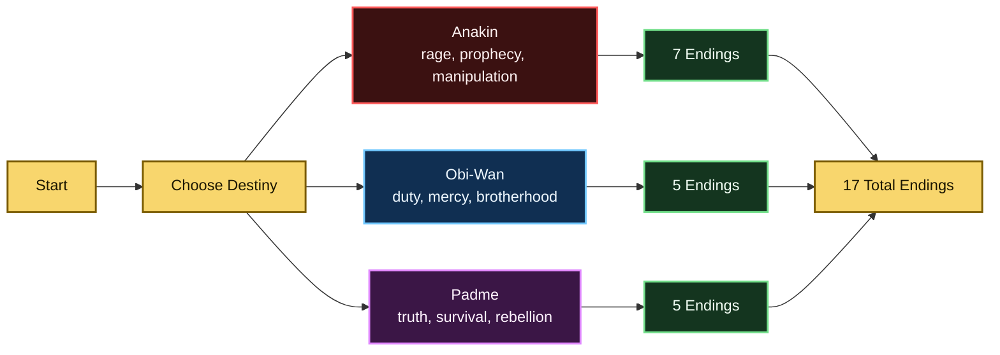

# Star Wars: Duel of Fates

**Duel of Fates** is an unofficial, fan-made cinematic terminal adventure inspired by the Mustafar confrontation in *Star Wars: Episode III - Revenge of the Sith*.

The game reimagines the fall of the Republic as an interactive text RPG with branching scenes, playable protagonists, morality shifts, relationship meters, turn-based duels, secret evidence, animated terminal set pieces, optional music, and multiple alternate endings.

## Features

- Three playable routes: **Anakin Skywalker**, **Obi-Wan Kenobi**, and **Padme Amidala**
- Branching narrative scenes with route-specific choices, consequences, and endings
- Morality, clarity, relationship, codex, secret, and memory-shard systems
- Turn-based lightsaber combat with stamina, Force power, items, enemy defense, and critical hits
- Padme route focused on political thriller choices, survival, evidence, broadcasts, and rebellion-building
- Animated terminal set pieces for lava surges, saber locks, Senate transmissions, medical scans, escapes, and mask-forging moments
- Pixel-style ASCII portraits for major characters
- Dynamic audio moods and synthesized SFX through `pygame`
- Manual save, load, autosave, and runtime save cleanup after completed endings
- Fast test mode through `DUEL_OF_FATES_FAST=1`

## Choice & Ending Map

The full spoiler-heavy route map is available in [docs/CHOICE_MAP.md](docs/CHOICE_MAP.md). It covers the three protagonist routes, major choices, conditional unlocks, combat gates, secret flags, and all 17 endings.



## Playable Routes

### Anakin Skywalker

Anakin's route follows rage, fear, prophecy, manipulation, and the possibility of refusing the fate prepared for him.

Route highlights:

- Search the Separatist facility for tools and hidden evidence
- Discover Sidious's Mustafar contingency
- Experience Force visions and memory shards
- Decide Padme's fate, Obi-Wan's fate, and whether Vader is inevitable
- Unlock dark, redemptive, exile, alliance, and rebellion endings

### Obi-Wan Kenobi

Obi-Wan's route explores duty, grief, mercy, and the danger of accepting a tragedy written by the Sith.

Route highlights:

- Choose when and how to confront Anakin
- Hear a Force echo that reframes Mustafar as a staged wound
- Warn Bail Organa, stabilize Padme, or call to Anakin through the Force
- Duel Anakin with relationship and clarity effects
- Unlock canon-inspired, mercy, miracle, and secret broken-mask endings

### Padme Amidala

Padme's route turns the Mustafar arc into a political survival thriller.

Route highlights:

- Investigate Palpatine's emergency records on Coruscant
- Build early resistance links with Bail Organa
- Bring evidence, medical support, transmitters, or droid escape plans to Mustafar
- Confront Anakin with love, proof, truth, or public witness
- Turn the duel into a broadcast, rescue, cover-up, or rebellion
- Unlock endings where Padme becomes a hidden survivor, public rebel, ruthless imperial enemy, or the person who keeps Anakin alive and answerable

## Game Systems

### Morality

Morality tracks movement toward the Light Side, Dark Side, or a conflicted middle. It changes dialogue, unlocks or blocks certain outcomes, and influences combat tone.

### Clarity

Clarity measures how well the current protagonist understands Sidious's manipulation. High clarity opens secret routes, stronger confrontation options, and public truth endings.

### Relationships

Two major relationship meters shape the story:

- **Padme Bond**: trust, love, protection, and emotional connection around Padme
- **Brotherhood Bond**: the remaining bridge between Anakin and Obi-Wan

### Codex

The codex records discoveries such as hidden files, Force insights, character truths, and political evidence. It can be opened during most choice prompts with `C`.

### Memory Shards

Memory shards are emotional fragments unlocked by visions, old promises, confessions, and pivotal choices. They can be opened during most choice prompts with `M`.

### Combat

Combat includes:

- Strike
- Defend
- Force Push
- Force Heal
- Center Yourself
- Bacta Patch usage
- Emergency Flare usage
- Thermal Detonator usage
- Stamina pressure
- Enemy defense
- Stuns, critical hits, and mid-fight dialogue

### Audio

The game uses `pygame` for optional audio. If audio is unavailable, the game continues silently.

Audio behavior includes:

- Music mood changes by scene type
- Reuse of `song.mp3` when present
- Synthesized SFX cues for choices, secrets, memories, damage, healing, and clashes
- Graceful fallback without required sound-effect files

## Installation

```bash
git clone git@github.com:alinikan/StarWars-Text-Adventure.git
cd StarWars-Text-Adventure
pip install -r requirements.txt
```

## Run

```bash
python3 main.py
```

Fast mode for testing:

```bash
DUEL_OF_FATES_FAST=1 python3 main.py
```

## Controls

During choice prompts:

- Enter a number to choose an option
- `S` saves the current game
- `L` loads the current save
- `C` opens the codex and status menu
- `M` opens memory shards
- `Q` quits, with an option to save first
- `H` shows command help

## Project Structure

```text
StarWars-Text-Adventure/
├── docs/
│   └── CHOICE_MAP.md         # spoiler-heavy route and ending map
├── main.py                  # game code
├── README.md                # public project documentation
├── requirements.txt         # Python dependencies
├── song.mp3                 # optional background music
└── duel_of_fates_save.json  # generated runtime save, ignored by Git
```

## Dependencies

- Python 3.8+
- `colorama`
- `pygame`

## Save Data

The game writes `duel_of_fates_save.json` during play. The file is runtime state and is ignored by Git.

Completed runs delete the active save so finished endings do not resume from old autosave points.

## Status

The current version includes:

- 45 narrative scenes
- 3 playable routes
- 17 ending scenes
- In-game codex and memory menus
- Animated terminal set pieces
- Dynamic audio mood and SFX cues

## Disclaimer

This is an unofficial fan project. Star Wars and related names, characters, and settings belong to their respective rights holders.
