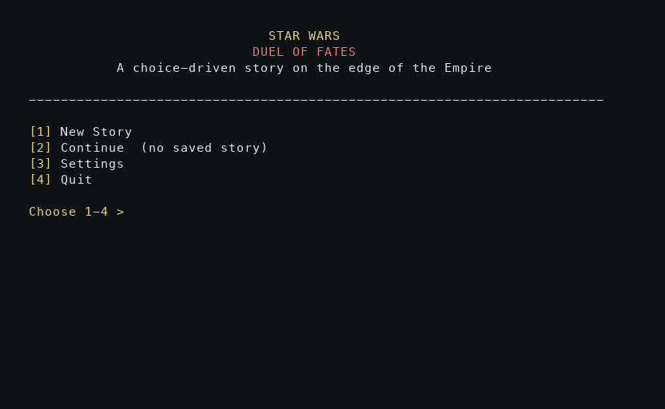
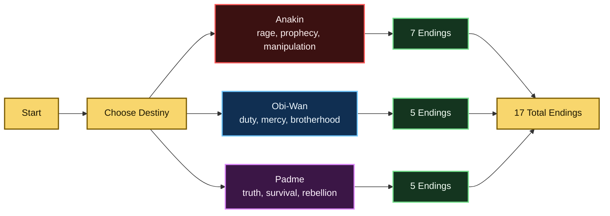
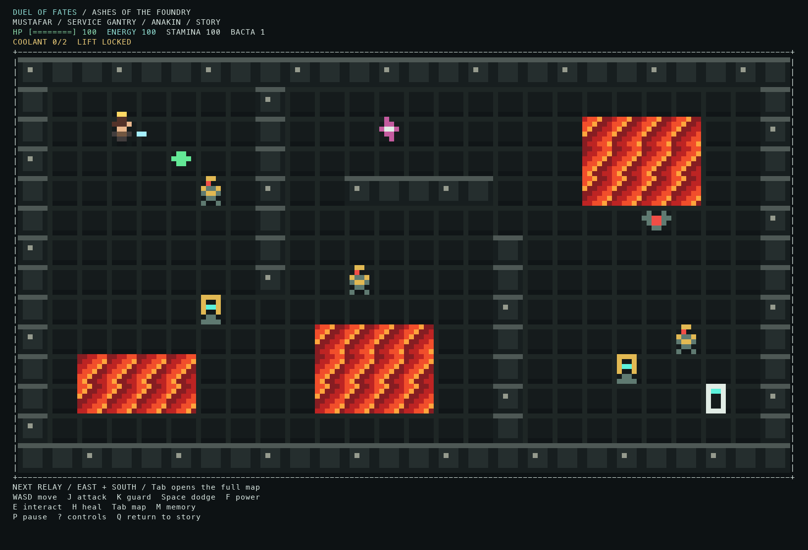

# Star Wars: Duel of Fates

**Duel of Fates** is an unofficial, fan-made cinematic terminal adventure inspired by the Mustafar confrontation in *Star Wars: Episode III - Revenge of the Sith*.

The game reimagines the fall of the Republic as a choice-driven adventure with three playable protagonists and 17 endings. Uncover a conspiracy, protect a fragile alliance, or become the very thing the galaxy fears. Numbered decisions drive the story, including its turn-based lightsaber duels.



Two investigations offer optional 2D pixel missions inside the terminal. They are short side encounters, not a replacement for the narrative, and can be skipped entirely.

## Features

- Three playable routes: **Anakin Skywalker**, **Obi-Wan Kenobi**, and **Padme Amidala**
- Branching narrative scenes with route-specific choices, consequences, and endings
- Morality, clarity, relationship, codex, secret, and memory-shard systems
- Turn-based lightsaber combat with stamina, Force power, items, enemy defense, and critical hits
- Two optional terminal missions with direct movement, blaster combat, lightsabers, dodges, guards, and readable attack warnings
- Original six-by-six half-block sprites, animated lava, a following camera, contextual objectives, and ASCII display
- Pausable mission map and memory journal; Padme's archive includes a three-ring cipher puzzle
- Padme route focused on political thriller choices, survival, evidence, broadcasts, and rebellion-building
- Animated terminal set pieces for lava surges, saber locks, Senate transmissions, medical scans, escapes, and mask-forging moments
- Pixel-style ASCII portraits for major characters
- Continuous soundtrack playback, optional real mood tracks, and short sound effects through `pygame`
- Independent music/SFX controls, optional-mission difficulty, reduced motion, and automatic pause on terminal resizing
- A dedicated start menu with stable New Story, Continue, Settings, and Quit choices
- Manual save, load, autosave, and runtime save cleanup after completed endings
- Fast test mode through `DUEL_OF_FATES_FAST=1`

## Choice & Ending Map

The full spoiler-heavy route map is available in [docs/CHOICE_MAP.md](docs/CHOICE_MAP.md). It covers the three protagonist routes, major choices, conditional unlocks, combat gates, secret flags, and all 17 endings.


```mermaid
flowchart LR
    Start["Start"]:::hub --> Choice["Choose Destiny"]:::hub
    Choice --> Anakin["Anakin<br/>rage, prophecy, manipulation"]:::anakin
    Choice --> ObiWan["Obi-Wan<br/>duty, mercy, brotherhood"]:::obiwan
    Choice --> Padme["Padme<br/>truth, survival, rebellion"]:::padme

    Anakin --> AEnds["7 Endings"]:::ending
    ObiWan --> OEnds["5 Endings"]:::ending
    Padme --> PEnds["5 Endings"]:::ending

    AEnds --> Total["17 Total Endings"]:::hub
    OEnds --> Total
    PEnds --> Total

    classDef hub fill:#f8d66d,stroke:#7a5b00,color:#1b1600,stroke-width:2px;
    classDef anakin fill:#3b1111,stroke:#ff5a5a,color:#fff3f3,stroke-width:2px;
    classDef obiwan fill:#102f52,stroke:#71c8ff,color:#eef8ff,stroke-width:2px;
    classDef padme fill:#3b1646,stroke:#df87ff,color:#fff4ff,stroke-width:2px;
    classDef ending fill:#14351f,stroke:#72df8a,color:#f3fff5,stroke-width:2px;
```

## Optional Terminal Missions

After choosing to search Anakin's control room or investigate Padme's Senate records, the story offers **Continue the story** or **Play the optional 2D terminal mission**. No mission opens automatically. **Settings > Optional 2D missions > Skip** disables both offers.



| Encounter | Setting | Mission |
| --- | --- | --- |
| **Ashes of the Foundry** | Mustafar service gantry | Fight security droids, activate two coolant relays, recover a worker's memory, and reach the evacuation lift. |
| **The Last Senate Signal** | Coruscant sealed archive | Recover three cipher fragments, align the relay rings, and get an archivist's list off-world. |

Anakin carries a lightsaber; Padme uses a ranged blaster and an ion pulse. The world pauses while reading the briefing, map, memory journal, controls, or cipher puzzle. The camera follows the protagonist, and the HUD points toward the next objective.

Successful missions grant supplies, clarity, and any recovered memory shard. Padme's archive success also establishes a resistance link. Each reward can be earned once per run. Skipping, leaving, or failing a mission returns to the narrative without reducing story health or blocking an ending.

The main Anakin and Obi-Wan duels are always turn-based. Optional missions have independent health and resources; their remaining combat stats never replace campaign stats.

Standalone practice remains available with `python3 main.py --arcade`, including a three-wave training trial. `--mission duel` opens a separate practice arena with no campaign consequences.

Mission rules and campaign rewards are documented in [the action guide](docs/ACTION_GUIDE.md).

## Playable Routes

### Anakin Skywalker

Anakin's route follows rage, fear, prophecy, manipulation, and the possibility of refusing the fate prepared for him.

Route highlights:

- Search the Separatist facility for tools and hidden evidence
- Discover Sidious's Mustafar contingency
- Experience Force visions and memory shards
- Decide Padme's fate, Obi-Wan's fate, and whether Vader is inevitable
- Unlock dark, redemptive, exile, alliance, and rebellion endings

### Obi-Wan Kenobi

Obi-Wan's route explores duty, grief, mercy, and the danger of accepting a tragedy written by the Sith.

Route highlights:

- Choose when and how to confront Anakin
- Hear a Force echo that reframes Mustafar as a staged wound
- Warn Bail Organa, stabilize Padme, or call to Anakin through the Force
- Duel Anakin with relationship and clarity effects
- Unlock canon-inspired, mercy, miracle, and secret broken-mask endings

### Padme Amidala

Padme's route turns the Mustafar arc into a political survival thriller.

Route highlights:

- Investigate Palpatine's emergency records on Coruscant
- Build early resistance links with Bail Organa
- Bring evidence, medical support, transmitters, or droid escape plans to Mustafar
- Confront Anakin with love, proof, truth, or public witness
- Turn the duel into a broadcast, rescue, cover-up, or rebellion
- Unlock endings where Padme becomes a hidden survivor, public rebel, ruthless imperial enemy, or the person who keeps Anakin alive and answerable

## Game Systems

### Morality

Morality tracks movement toward the Light Side, Dark Side, or a conflicted middle. It changes dialogue, unlocks or blocks certain outcomes, and influences combat tone.

### Clarity

Clarity measures how well the current protagonist understands Sidious's manipulation. High clarity opens secret routes, stronger confrontation options, and public truth endings.

### Relationships

Two major relationship meters shape the story:

- **Padme Bond**: trust, love, protection, and emotional connection around Padme
- **Brotherhood Bond**: the remaining bridge between Anakin and Obi-Wan

### Codex

The codex records discoveries such as hidden files, Force insights, character truths, and political evidence. It can be opened during most choice prompts with `C`.

### Memory Shards

Memory shards are emotional fragments unlocked by visions, old promises, confessions, and pivotal choices. They can be opened during most choice prompts with `M`.

### Combat

Combat includes:

- Strike
- Defend
- Force Push
- Force Heal
- Center Yourself
- Bacta Patch usage
- Emergency Flare usage
- Thermal Detonator usage
- Stamina pressure
- Enemy defense
- Stuns, critical hits, and mid-fight dialogue

### Audio

The game uses `pygame` for optional audio. If audio is unavailable, the game continues silently.

Audio behavior includes:

- The root-level `song.mp3` continues from the title into the story without restarting on mood changes
- Real custom mood tracks in `assets/audio/` take precedence when present; missing or unreadable tracks fall back to `song.mp3`
- Synthesized SFX cues for choices, secrets, memories, damage, healing, and clashes
- Graceful fallback without required sound-effect files
- Separate music and sound-effect controls in Settings; `--mute` silences both on launch

There is no synthesized background drone. Without a usable music file, the game stays silent. Mission sound effects do not pause combat. Custom track names and redistribution guidance are listed in [assets/audio/README.md](assets/audio/README.md).

## Installation

```bash
git clone https://github.com/alinikan/StarWars-Text-Adventure.git
cd StarWars-Text-Adventure
python3 -m venv .venv
source .venv/bin/activate
python3 -m pip install -r requirements.txt
```

On Windows, activate with `.venv\Scripts\activate` instead. Python **3.10+** is required. An **80 × 24** terminal suits the story. Optional pixel missions require **64 × 26** or larger; **110 × 40** gives a more generous scrolling view, and **160 × 54** shows the full map. Smaller windows pause the mission automatically.

## Run

```bash
python3 main.py
```

Launch a specific mission or choose an accessible display:

```bash
python3 main.py --mission archive --character padme
python3 main.py --arcade --difficulty story --reduced-motion
python3 main.py --mute
python3 main.py --arcade --ascii
```

Pixel missions respond to keys immediately. Story choices still use a number followed by Enter. `NO_COLOR=1` selects monochrome ASCII tiles while retaining fullscreen positioning. IDE output panes without an interactive terminal fall back to the narrative and classic combat.

Fast mode for testing:

```bash
DUEL_OF_FATES_FAST=1 python3 main.py
```

## Controls

During choice prompts:

- Enter a number to choose an option
- `S` saves the current game
- `L` loads the current save
- `C` opens the codex and status menu
- `M` opens memory shards
- `O` opens terminal settings
- `Q` quits, with an option to save first
- `H` shows command help

During pixel missions:

| Key | Action |
| --- | --- |
| `WASD` / arrow keys | Move and face a direction |
| `J` | Lightsaber sweep / Padme's blaster |
| `K` | Brief guard; repeat to maintain it |
| `Space` | Dodge in the facing direction |
| `F` | Force pulse / Padme's ion pulse |
| `E` | Activate relay / use exit |
| `H` | Apply a bacta charge |
| `Tab` | Open the holo-map |
| `M` | Read the recovered mission memory and recent signals |
| `P` | Pause or resume |
| `?` | Mission controls |
| `Q` / Escape | Leave with confirmation |

During cipher slicing, left/right select a ring, up/down rotate it, and `J` or Enter transmits the checksum. The world pauses while the puzzle is open.

## Project Structure

```text
StarWars-Text-Adventure/
├── holotactics/             # simulation, original sprites, renderer, input, records
├── assets/audio/            # optional custom music slots
├── docs/
│   ├── images/              # actual terminal captures and README gallery
│   ├── ACTION_GUIDE.md      # missions, combat, rewards
│   ├── CHOICE_MAP.md        # spoiler-heavy route and ending map
│   └── DEVELOPMENT.md       # architecture, verification, sources
├── tests/                   # gameplay and persistence regression tests
├── tools/terminal_smoke.py  # live terminal checks and screenshot export
├── main.py                  # branching story and audio engine
├── README.md                # public project documentation
├── requirements.txt         # Python dependencies
├── requirements-dev.txt     # optional verification/screenshot dependencies
├── song.mp3                 # optional background music
├── duel_of_fates_save.json   # active story save, ignored by Git
└── duel_of_fates_profile.json # local arcade records, ignored by Git
```

## Dependencies

- Python 3.10+
- `colorama`
- `pygame`
- `blessed` for fullscreen terminal input and restoration
- `pathfinding` for A* enemy navigation

The core story can still run without the two expansion libraries. Install the full requirements to enable pixel missions.

## Save Data

The game writes `duel_of_fates_save.json` during play. The file is runtime state and is ignored by Git.

Arcade personal bests, clears, and recovered-memory records are stored separately in `duel_of_fates_profile.json`. Both files live beside `main.py`, even when the game is launched from another directory. Active missions are not saved mid-fight. Settings and campaign mission rewards travel with the story save.

Completed runs delete the active save so finished endings do not resume from old autosave points.

## Status

The current version includes:

- 45 narrative scenes
- 3 playable routes
- 17 ending scenes
- In-game codex and memory menus
- Animated terminal set pieces
- Dynamic audio mood and SFX cues
- 2 optional story missions, a standalone training trial, and a practice arena
- Pixel and ASCII displays with direct keyboard control
- Campaign-connected discoveries and separate arcade records

## Development

```bash
python3 -m pip install -r requirements-dev.txt
python3 -m unittest discover -s tests -v
python3 tools/terminal_smoke.py
python3 tools/story_smoke.py
```

The smoke tests use real pseudo-terminals on macOS/Linux to check story navigation, overlay return, movement, attacks, pause, resizing, and exit without touching the player's save. They export the terminal captures used in this README. See [development notes and research sources](docs/DEVELOPMENT.md).

## Disclaimer

This is an unofficial fan project. Star Wars and related names, characters, and settings belong to their respective rights holders.
