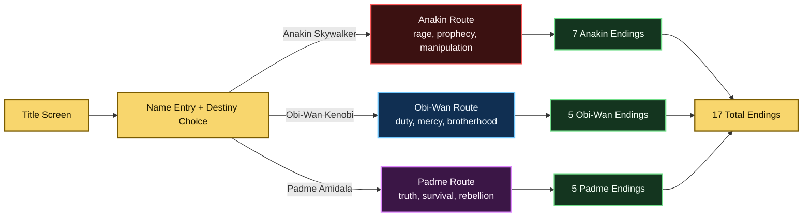
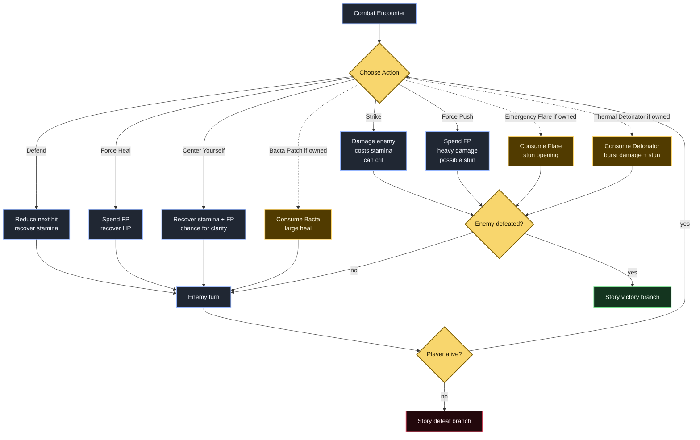
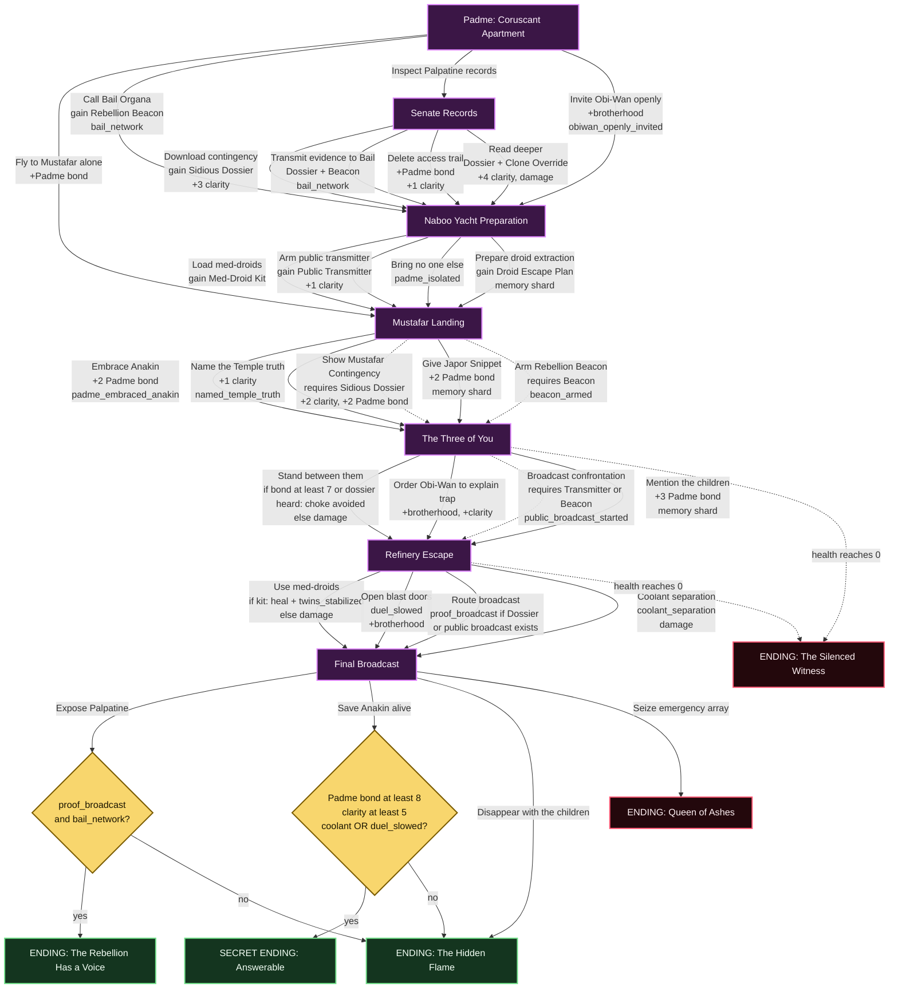
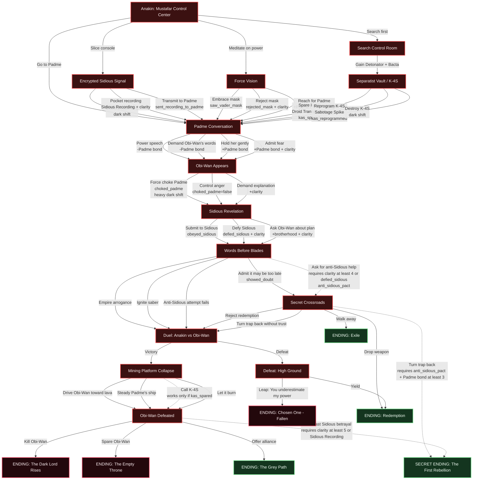
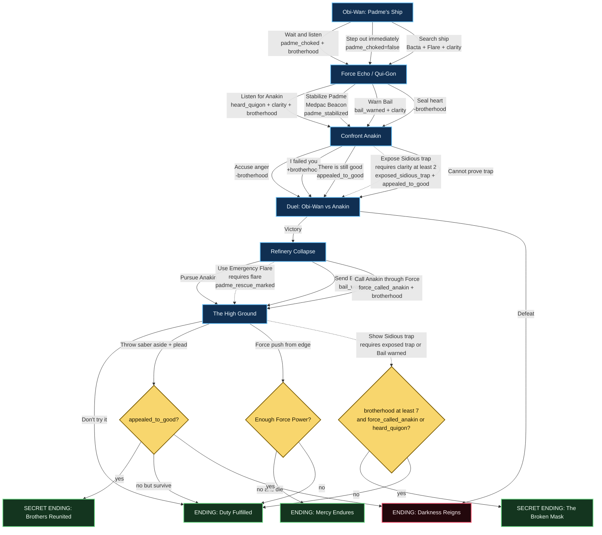

# Duel of Fates Choice & Ending Map

This spoiler-heavy map documents the playable routes, major choices, conditional branches, combat gates, and all known endings in **Star Wars: Duel of Fates**.

## Legend

| Shape / Color | Meaning |
| --- | --- |
| Gold | Start, setup, or route hub |
| Red | Anakin route |
| Blue | Obi-Wan route |
| Purple | Padme route |
| Green | Hopeful or redemptive ending |
| Black / Crimson | tragic or dark ending |
| Dashed arrows | conditional unlocks |

## Route Constellation

## Universal Combat Loop

Most lightsaber duels pass through the same combat engine. Story choices before combat can change enemy strength, Force power, stamina pressure, or secret outcomes after victory.

## Padme Route Map

Padme's route is a political survival thriller: evidence, witnesses, medical preparation, and public truth determine whether Mustafar becomes a private tragedy or the first crack in the Empire.

## Anakin Route Map

Anakin's route is built around fear, possession, prophecy, and the possibility of discovering that Sidious designed the duel itself.

## Obi-Wan Route Map

Obi-Wan's route is about whether duty remains humane when history asks for violence.

## Ending Gallery

| Route | Ending | Primary Unlock |
| --- | --- | --- |
| Padme | The Rebellion Has a Voice | Final Broadcast: expose Palpatine with `proof_broadcast` and `bail_network` |
| Padme | Answerable | Save Anakin with `Padme bond >= 8`, `clarity >= 5`, and `coolant_separation` or `duel_slowed` |
| Padme | The Hidden Flame | Disappear with children, or fail the proof/save-Anakin requirements |
| Padme | Queen of Ashes | Seize the Separatist emergency array |
| Padme | The Silenced Witness | Padme reaches 0 HP before the final broadcast |
| Anakin | The Dark Lord Rises | Defeat Obi-Wan, then kill him |
| Anakin | Chosen One - Fallen | Lose the duel, then leap at Obi-Wan |
| Anakin | Redemption | Drop weapon at Crossroads, yield after defeat, or choose the light |
| Anakin | Exile | Crossroads: walk away from Mustafar |
| Anakin | The Empty Throne | Defeat Obi-Wan, then spare him without true redemption |
| Anakin | The Grey Path | Defeat Obi-Wan, then offer alliance |
| Anakin | The First Rebellion | Turn the trap back with enough trust, or broadcast Sidious's betrayal after victory |
| Obi-Wan | Duty Fulfilled | High Ground: warn Anakin, or fail secret mercy/trap conditions but survive |
| Obi-Wan | Darkness Reigns | Lose combat, or plead without enough trust and die |
| Obi-Wan | Brothers Reunited | High Ground: plead after `appealed_to_good` |
| Obi-Wan | Mercy Endures | High Ground: Force push Anakin back with enough Force power |
| Obi-Wan | The Broken Mask | Show Sidious's trap with enough brotherhood and Force-call/Qui-Gon support |

## Secret Condition Index

| Condition | How It Is Usually Built |
| --- | --- |
| `bail_network` | Padme calls Bail, or transmits Senate evidence to Bail |
| `proof_broadcast` | Padme routes the emergency broadcast after obtaining a dossier or starting the public broadcast |
| `anakin_heard_dossier` | Padme shows Anakin the Mustafar Contingency |
| `public_broadcast_started` | Padme broadcasts the confrontation with a Public Transmitter or armed Beacon |
| `duel_slowed` | Padme opens blast doors during the refinery escape |
| `coolant_separation` | Padme triggers coolant floods during the refinery escape |
| `anti_sidious_pact` | Anakin asks Obi-Wan for help after gaining enough clarity or defying Sidious |
| `Sidious Recording` | Anakin pockets the encrypted recording |
| `kas_spared` | Anakin spares K-4S in the Separatist vault |
| `appealed_to_good` | Obi-Wan says there is still good in Anakin, or exposes the Sith trap with enough clarity |
| `exposed_sidious_trap` | Obi-Wan names Sidious's script with `clarity >= 2` |
| `bail_warned` | Obi-Wan sends a coded warning or later proof to Bail |
| `force_called_anakin` | Obi-Wan slows down during the collapse and speaks Anakin's name through the Force |
| `heard_quigon` | Obi-Wan listens for Anakin beneath Vader during the Force Echo |
